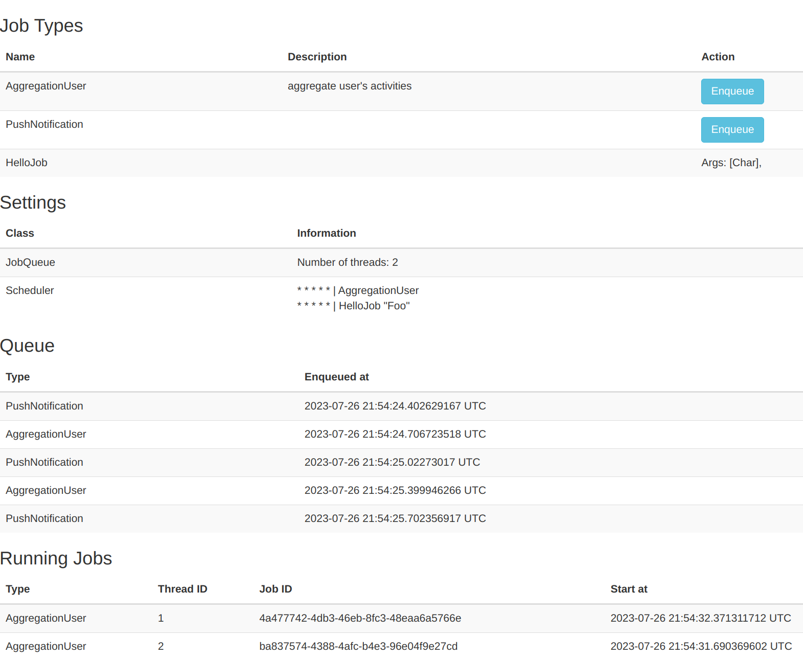

# yesod-job-queue
Background jobs library for Yesod.
Fork of [nakaji-dayo/yesod-job-queue](https://github.com/nakaji-dayo/yesod-job-queue).

- There are API and Web UI for managing the job.
- Queue backend is Redis.
- Multithreaded.


## Web interface

The web interface needs CSS Bootstrap and htmx.



## Usage

Prepare the JobState to manage the running jobs
``` haskell
import Yesod.JobQueue

data App = App {
    appConnPool :: ConnectionPool
    , appDBConf :: SqliteConf
    , appJobState :: JobState
    }

-- e.g. In makeFoundation
main = do
    jobState <- newJobState -- create JobState
    let app = App pool dbConf jobState
```

Make the routes for API & Manager UI
``` haskell
mkYesod "App" [parseRoutes|
/ HomeR GET
/job JobQueueR JobQueue getJobQueue -- ^ JobQueue API and Manager
|]
```

Define the job. And, to the setting of JobQueue
``` haskell
-- Your job type
data MyJobType = AggregationUser
               | PushNotification
               | HelloJob String
               deriving (Show, Read, Generic)

-- JobQueue settings
instance YesodJobQueue App where
    type JobType App = MyJobType
    getJobState = appJobState
    threadNumber _ = 2
    runDBJob action = do -- Required if you use the DB in the job
        app <- ask
        runSqlPool action $ appConnPool app
    -- Your Job code
    runJob _ AggregationUser = do
        us <- runDBJob $ selectList ([] :: [Filter Person]) []
        liftIO $ threadDelay $ 10 * 1000 * 1000
        print us
        putStrLn "complate job!"
    runJob _ PushNotification = do
        putStrLn "sent norification!"
    runJob _ (HelloJob name) = do
        putStrLn . pack $ "Hello " ++ name
```

Please see `example`

### Configration queue backend (Redis)
The default is to connect to `redis localhost:6379`.

And, you can change connect info by [queueConnectInfo](https://hackage.haskell.org/package/yesod-job-queue-0.2.0.1/docs/Yesod-JobQueue.html#v:queueConnectInfo)

## Build package
```
stack build
```

## Run example
```
stack build --flag yesod-job-queue:example && stack exec yesod-job-queue-example
```
You can access Web UI: `http://localhost:3000/job/manager`
